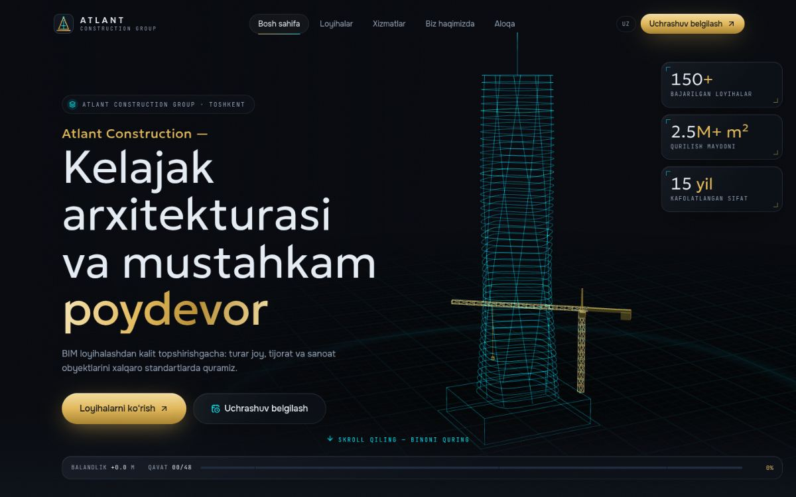
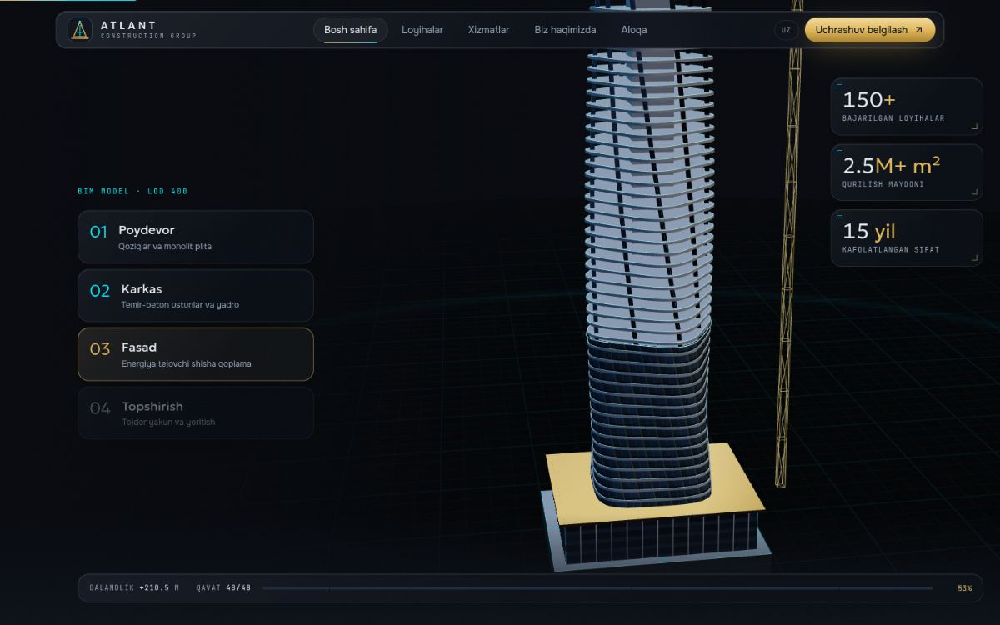
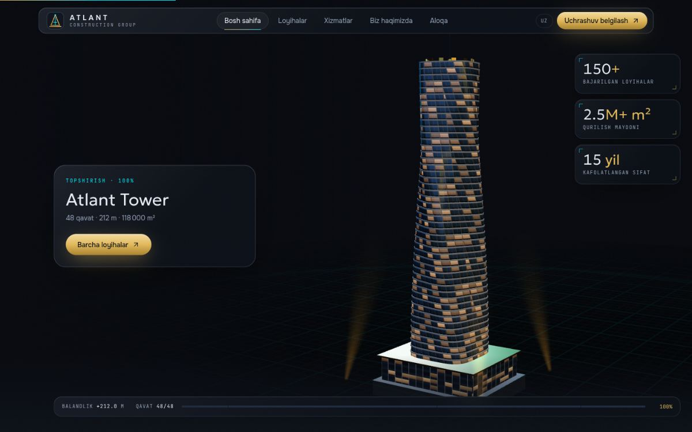
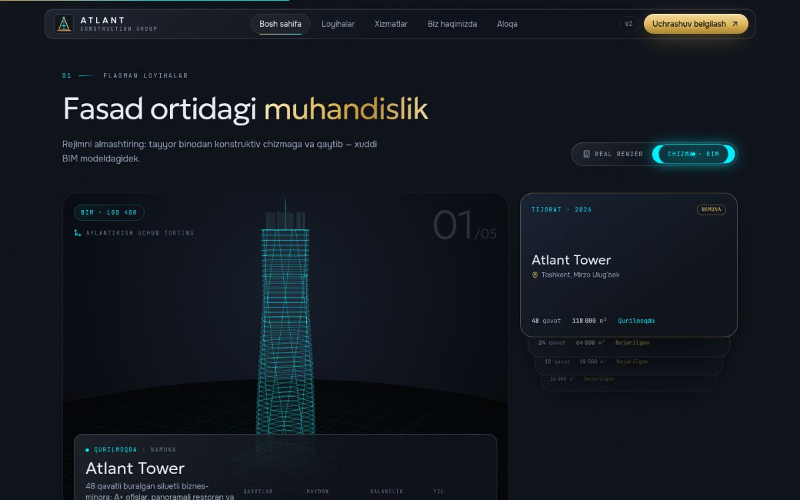
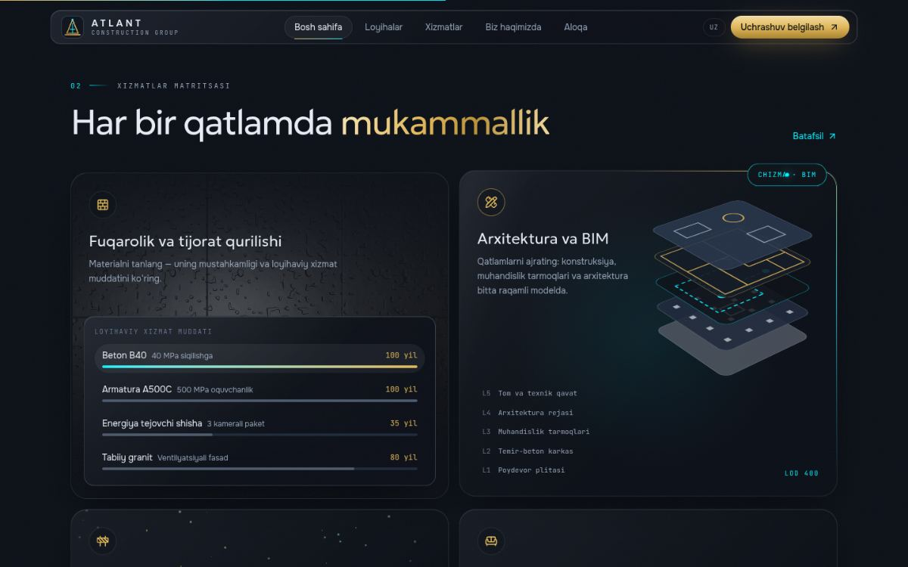
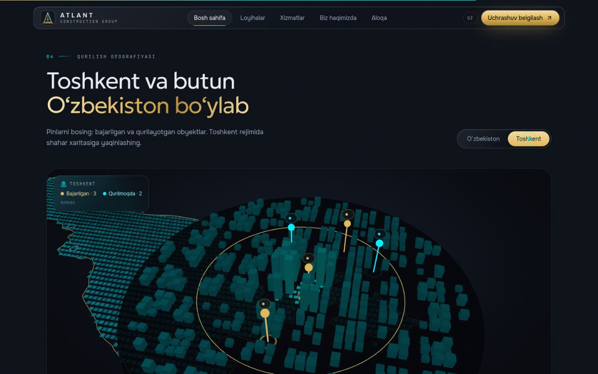
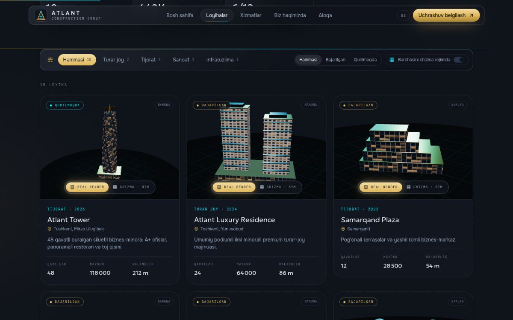
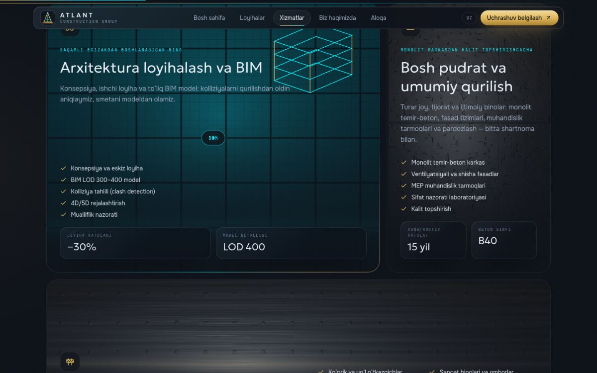
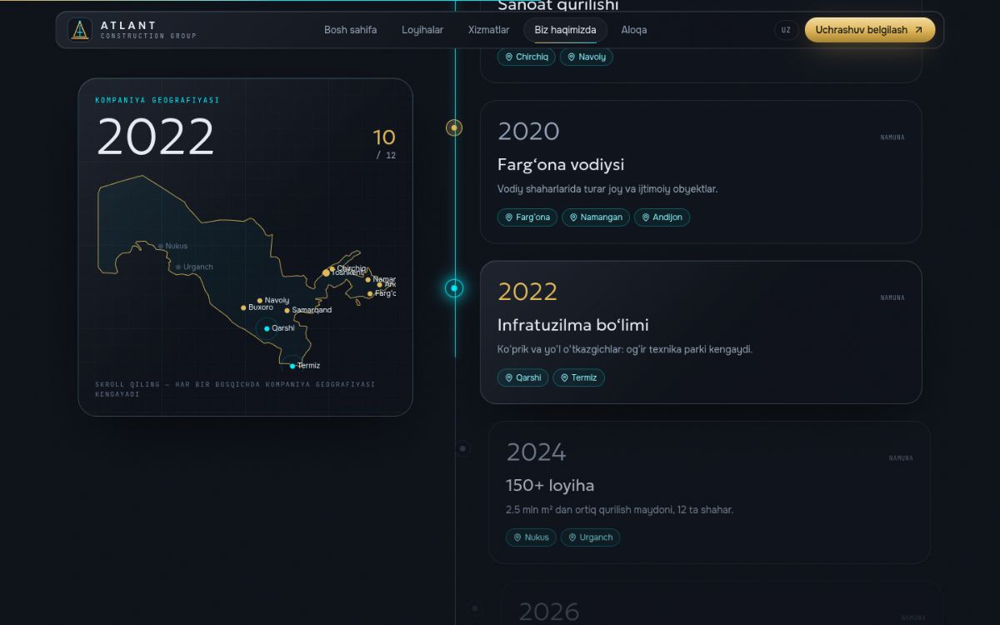
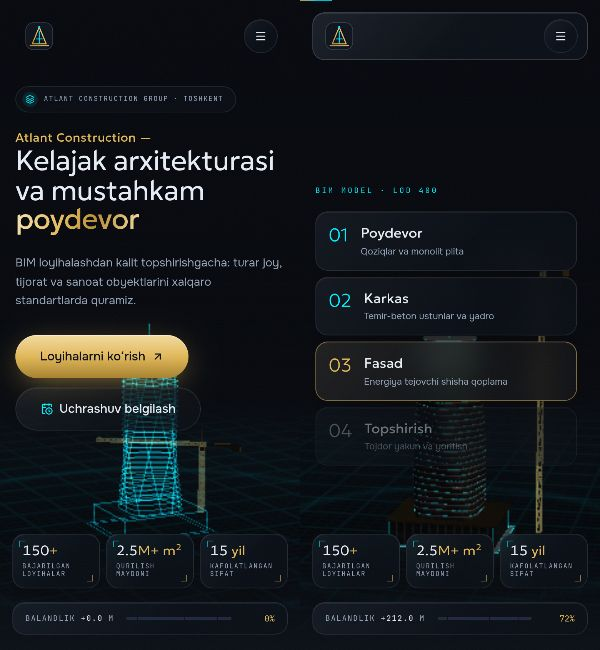

# ATLANT — Construction Group · Impossible Edition

Interactive 3D web showcase for **Atlant Construction Group** (agcg.uz): "Architectural Grandeur Meets Cyber-Futurism".
Uzbek-first (`/uz`), statically generated, four routes, one procedural 3D building engine.

| Scroll-to-build hero | | |
| --- | --- | --- |
|  |  |  |
| **Blueprint / realistic showcase** | **Services matrix** | **Tashkent footprint map** |
|  |  |  |
| **/projects** | **/services** | **/about** |
|  |  |  |



## Quick start

```bash
# Node ≥ 20.9
npm install
npm run dev              # http://localhost:3000 → /uz
npm run build && npm start
npm run typecheck
cp .env.example .env.local   # optional: TELEGRAM_BOT_TOKEN / TELEGRAM_CHAT_ID for bookings
```

QA helper: append `?lod=high|mid|low|none` to any URL to force a 3D level-of-detail tier.

## Routes

| Route | What it is |
| --- | --- |
| `/uz` | Scroll-built 3D hero, flagship showcase, services matrix, cost & timeline estimator, 3D map, booking portal |
| `/uz/projects` | Filterable gallery. Every card is a live 3D model with its own Blueprint ⇄ Realistic switch (plus a global switch) |
| `/uz/services` | Bento of BIM · General construction · Heavy infrastructure over live material shaders |
| `/uz/about` | GSAP ScrollTrigger timeline with a sticky map that lights up the company footprint |

`/`, `/projects`, `/services`, `/about` redirect to the `/uz/…` equivalents.

## Stack

Next.js 15.5 (App Router, RSC, Server Actions, SSG) · React 19 · Tailwind CSS v4 (`@theme` config) · three r186 · @react-three/fiber 9 · @react-three/drei 10 · GSAP 3 + ScrollTrigger + @gsap/react · Framer Motion · Lenis · Radix Slider · lucide-react · zod 4.
Fonts (self-hosted via `next/font`, all with Cyrillic): **Geologica** (variable, `SHRP` sharpness axis → `font-sharp` utility), **Onest**, **JetBrains Mono**.

## Architecture

```
src/
├─ app/
│  ├─ [locale]/
│  │  ├─ layout.tsx          # root layout: fonts, metadata, Header + Footer + Lenis (persist across routes)
│  │  ├─ template.tsx        # route transition: obsidian curtain + gold/cyan blade (opacity-only wrapper)
│  │  ├─ page.tsx            # ★ home (Server Component)
│  │  ├─ projects/page.tsx   # gallery
│  │  ├─ services/page.tsx   # services bento
│  │  └─ about/page.tsx      # timeline
│  ├─ actions/inquiry.ts     # "use server" booking: zod, Tashkent-time slot validation, honeypot, Telegram
│  └─ globals.css            # ★ design system (Tailwind v4 @theme tokens + glass/shimmer/blueprint utilities)
├─ components/
│  ├─ three/
│  │  ├─ BuildingHero3D.tsx  # ★ scroll-driven construction of the Atlant Tower
│  │  ├─ building/
│  │  │  ├─ geometry.ts      # procedural generators: twist-tower, twin-residential, stepped-office, industrial, courtyard, bridge
│  │  │  ├─ textures.ts      # canvas-drawn facade textures (curtain/residential/office/industrial/stone) + lit windows
│  │  │  ├─ materials.ts     # role materials, blueprint-line / grid-ground / volumetric-beam GLSL
│  │  │  ├─ Building.tsx     # reusable model with the Blueprint ⇄ Realistic clip-plane scan
│  │  │  └─ Stage.tsx        # environment (procedural light-formers), lights, blueprint ground
│  │  ├─ ShowcaseScene.tsx / ShowcaseStage.tsx   # single-model stage (home showcase)
│  │  ├─ GalleryViews.tsx    # ONE shared canvas + drei <View> per gallery card
│  │  ├─ UzMap3D.tsx / MapStage.tsx               # country dot-bars ⇄ Tashkent city dive, projected DOM pins
│  │  └─ SceneCanvas.tsx     # lazy mount, offscreen pause, LOD, PerformanceMonitor, fallbacks
│  ├─ shader/MaterialSurface.tsx   # raw-WebGL material shader (concrete/steel/glass/granite/blueprint), cursor-lit
│  ├─ sections/home/…, projects/…, services/…, about/…
│  ├─ layout/                # Header, Footer, NavLink (Lenis-aware), SmoothScroll (+ route scroll manager), cursor
│  └─ ui/                    # button, mode-toggle, page-header, section-heading, slider, spotlight-card, …
├─ data/projects.ts          # portfolio facts + 3D specs (language-neutral) · cities
├─ lib/                      # estimator.ts (pure model), booking.ts (slots, ICS), geo, motion variants, utils, site
├─ i18n/                     # config, get-dictionary, dictionaries/uz.ts (all copy)
└─ hooks/                    # useDeviceTier, useInViewport, useReducedMotion
```

### How the scroll-built hero works

The hero section is ~3.4 viewports tall and its stage is `position: sticky`. One GSAP ScrollTrigger (`scrub`) produces `progress ∈ [0,1]`, and both the WebGL scene and a scrubbed GSAP DOM timeline read it:

| progress | stage | 3D |
| --- | --- | --- |
| 0 | — | BIM wireframe draws itself on load (custom line shader, reveal by world-Y) |
| 0–0.10 | Poydevor | raft slab revealed by a clipping plane; pile lines glow below the grid |
| 0.08–0.55 | Karkas | core, instanced floor plates and twisting columns climb (clip plane #1) + tower crane |
| 0.30–0.86 | Fasad | curtain-wall skin climbs behind a glowing build-line ring (clip plane #2) |
| 0.82–1 | Topshirish | crown and spire scale in, crane dismantles, window lights and volumetric beams turn on |

The camera follows keyframes (wide → foundation → rising → hero shot). A film/view offset places the tower beside the headline on desktop and below it on phones. Readouts (height, floor, %) are written to the DOM through `requestAnimationFrame`, with no React re-renders.

### Blueprint ⇄ Realistic

`<Building>` renders every part twice: realistic materials clipped to `y ≤ h`, and a cyan ghost clipped to `y ≥ h`, plus structural lines shown above `h`. Toggling the mode sweeps `h` from the ground to the roof (or back) with a glowing scan plane. The home showcase, all gallery cards and the Tashkent map share this engine.

### Performance / LOD

- Every WebGL scene is a `next/dynamic({ ssr: false })` chunk. Home first-load JS is ~246 kB; three.js loads after hydration.
- Canvases mount near the viewport and pause (`frameloop="never"`) when offscreen. `PerformanceMonitor` lowers DPR under load.
- `/projects` renders 10 live buildings through **one** WebGL context (drei `View` scissor viewports).
- Tiers (`hooks/useDeviceTier.ts`) control DPR, antialiasing, environment maps, tower floor count (48/40/30) and map density. The `none` tier gets static SVG fallbacks.
- `prefers-reduced-motion` is honoured by Lenis, CSS, GSAP idle loops and 3D auto-motion.

### Routing & smooth scroll

Lenis lives in the root layout and persists across routes. `RouteScrollManager` resets its target on every navigation and resolves cross-page hashes (`/uz#contact` from `/uz/about`) after re-measuring. `NavLink` stops Next from double-handling same-page hashes so Lenis glides instead. Tested: client-side navigation (no reloads), scroll reset, cross-page and same-page anchors, back button.

## Content to replace before launch

agcg.uz was not reachable from the build environment. Every placeholder is flagged in code and badged **"Namuna"** in the UI:

- **Portfolio** (`src/data/projects.ts` + `projectsText` in the dictionary): the 10 projects are samples (incl. *Atlant Tower* / *Luxury Residence* from the brief).
- **Timeline** (`aboutPage.milestones`): sample company history, years and cities.
- **Contacts** (`src/lib/site.ts`): `null` values are hidden until filled.
- **Estimator** (`src/lib/estimator.ts`): cost/m², duration curve and warranty terms are planning assumptions.
- **Logo** (`components/ui/logo.tsx`, `app/icon.svg`): placeholder mark.

## Notes

- Next.js is pinned to **15.x**. `overrides.next.postcss` lifts Next's bundled PostCSS to a patched release (`npm audit` → 0 vulnerabilities).
- Glassmorphism uses only the standard `backdrop-filter`. Next's CSS minifier otherwise keeps just the `-webkit-` form, which Chrome ignores.
- Adding a locale: create `i18n/dictionaries/ru.ts` typed as `Dictionary`, then register it in `get-dictionary.ts` and `i18n/config.ts`.
- The earlier *Agro Global Consulting Group* build lives on branch `feat/agcg-impossible-web`.
