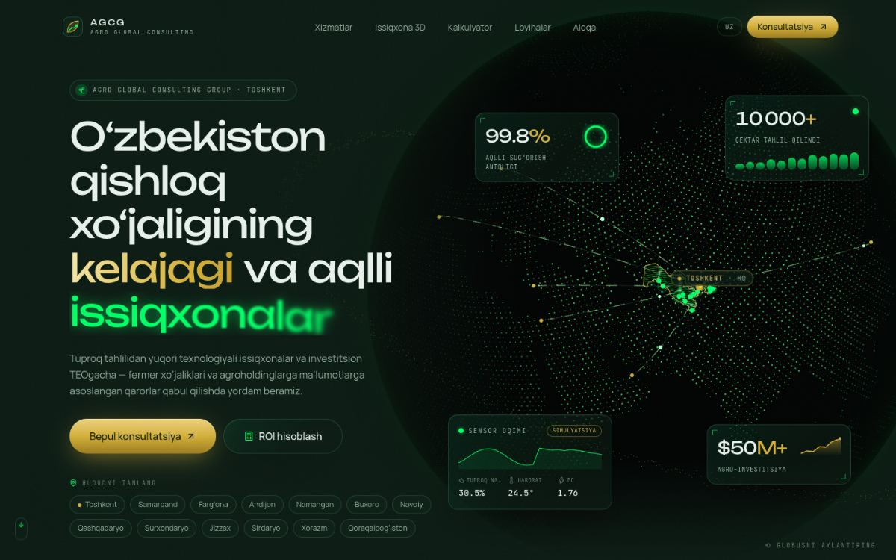
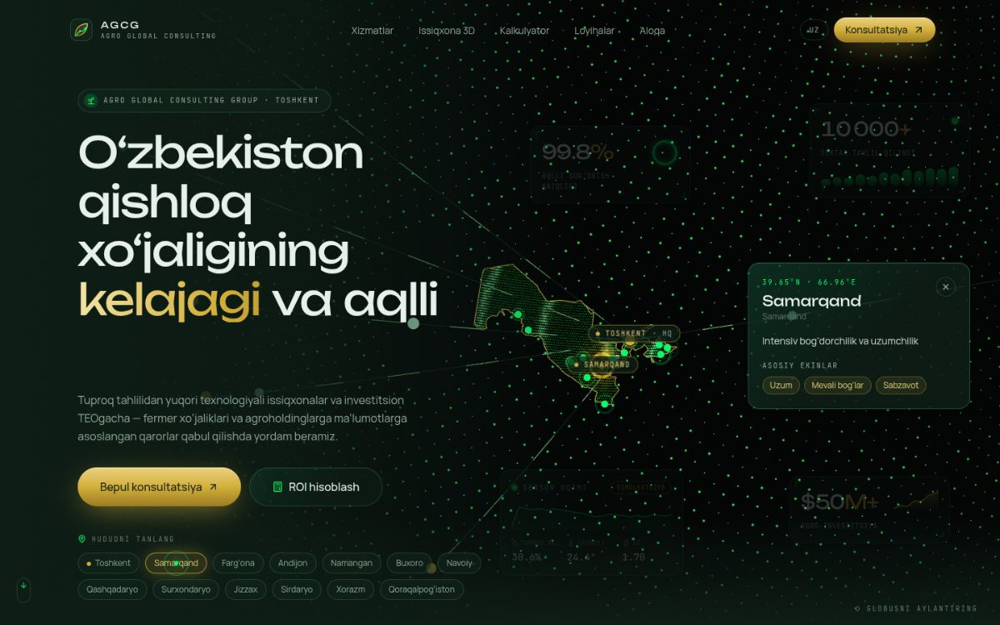
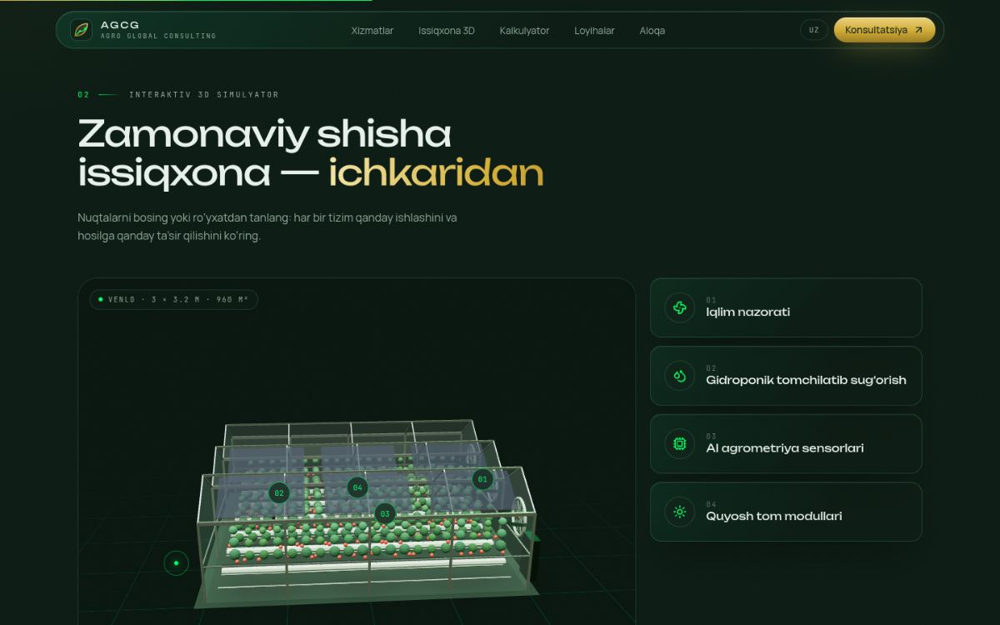
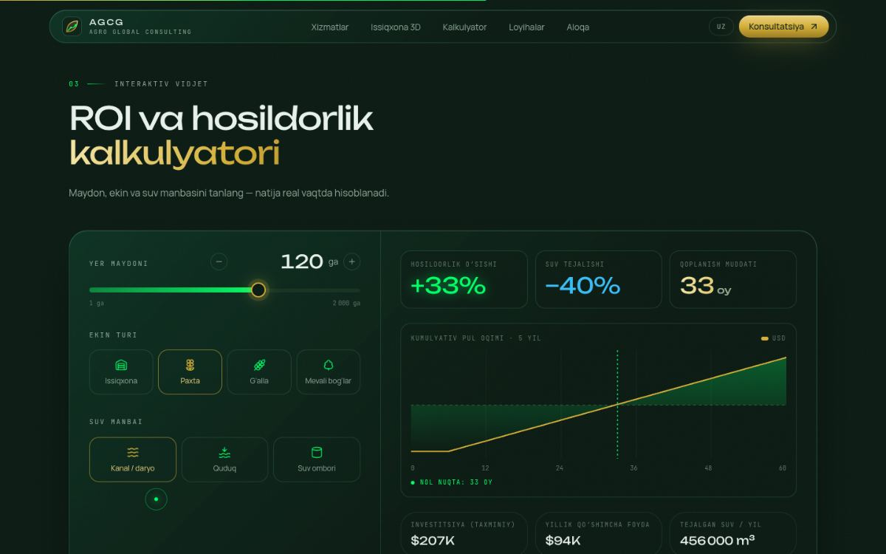
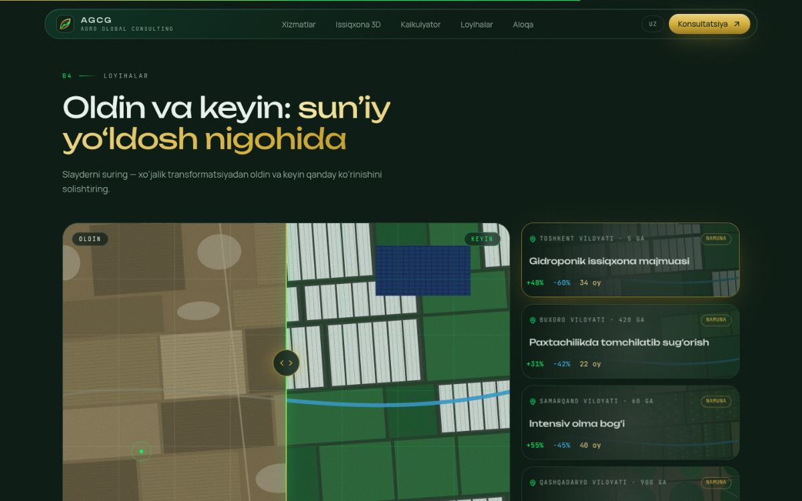

# AGCG — Impossible Edition

Next-generation interactive web experience for **Agro Global Consulting Group** (agcg.uz): smart farming meets high-tech futuristic luxe.
Uzbek-first (`/uz`), statically generated, with three lazily-loaded WebGL scenes.



| Region focus | 3D greenhouse | ROI calculator |
| --- | --- | --- |
|  |  |  |

| Before / after | Mobile |
| --- | --- |
|  |  |

## Quick start

```bash
# Node ≥ 20.9
npm install
npm run dev          # http://localhost:3000 → redirects to /uz
npm run build && npm start
npm run typecheck
```

Optional — forward consultation requests to Telegram:

```bash
cp .env.example .env.local   # fill TELEGRAM_BOT_TOKEN + TELEGRAM_CHAT_ID
```

QA helper: append `?lod=high|mid|low|none` to force a 3D level-of-detail tier (`none` = no-WebGL fallback).

## Stack

| Layer | Choice |
| --- | --- |
| Framework | **Next.js 15.5** (App Router, RSC, Server Actions, SSG via `generateStaticParams`), **React 19** |
| Styling | **Tailwind CSS v4** (CSS-first `@theme` config), shadcn/ui (new-york, custom glass variants), `class-variance-authority` |
| 3D | **three r186**, **@react-three/fiber 9**, **@react-three/drei 10**, custom GLSL |
| Motion | **GSAP 3** + ScrollTrigger + `@gsap/react`, **Framer Motion**, **Lenis** smooth scroll (driven by GSAP's ticker) |
| UI | lucide-react, Radix Slider |
| Validation | zod 4 (server action) |
| Fonts | Unbounded · Manrope · JetBrains Mono via `next/font/google` (self-hosted at build, **Latin + Cyrillic** so a Russian locale needs no font work) |

## Architecture

```
src/
├─ app/
│  ├─ [locale]/
│  │  ├─ layout.tsx        # root layout: fonts, metadata, JSON-LD, Lenis, cursor
│  │  ├─ page.tsx          # Server Component — loads dictionary, composes sections
│  │  └─ not-found.tsx
│  ├─ actions/consultation.ts   # "use server" — zod validation, honeypot, Telegram (fetch-only → Edge-ready)
│  ├─ globals.css          # ★ design system: Tailwind v4 @theme tokens, glass/shimmer/spotlight utilities
│  └─ icon.svg
├─ components/
│  ├─ three/
│  │  ├─ AgroGlobe.tsx     # ★ hero globe: land dots, UZ dot-matrix, region nodes, tech-hub arcs
│  │  ├─ shaders.ts        # GLSL for globe (reveal, ripples, atmosphere, beams)
│  │  ├─ GreenhouseScene.tsx  # procedural Venlo greenhouse + 4 interactive systems
│  │  ├─ ContactPortal.tsx    # extruded UZ map + dropping Tashkent pin
│  │  ├─ SceneCanvas.tsx      # shared Canvas shell: lazy mount, offscreen pause, LOD, fallback
│  │  └─ data/globe-data.json # 12 KB bitmask geo dataset (see scripts/)
│  ├─ sections/            # hero/, services/, greenhouse/, calculator/, projects/, contact/, Marquee
│  ├─ layout/              # Navbar, Footer, SmoothScroll (Lenis×GSAP), CursorFollower
│  └─ ui/                  # shadcn-style primitives: button, slider, spotlight-card, magnetic, …
├─ hooks/                  # useDeviceTier (LOD), useInViewport, useReducedMotion
├─ i18n/                   # config, get-dictionary, dictionaries/uz.ts (all copy lives here)
└─ lib/                    # roi.ts (pure ROI model), regions.ts, geo.ts, motion.ts (variants), site.ts
scripts/generate-globe-data.mjs   # world-atlas → bitmask dataset (npm run globe:data)
```

### Rendering strategy

- `page.tsx` is a **Server Component**; each client section receives only its own dictionary slice.
- Every WebGL scene is a separate **`next/dynamic({ ssr: false })` chunk**. The first-load JS for `/uz` is ~250 KB. three/R3F (~180 KB gzip) loads after hydration.
- `SceneCanvas` mounts each `<Canvas>` only when its section nears the viewport. It sets `frameloop="never"` while offscreen and wraps drei's `PerformanceMonitor` + `AdaptiveDpr`.
- The hero headline animates with **pure CSS** keyframes, so the LCP text paints before JS; GSAP drives the HUD timeline, counters and scroll-scrub.

### Level of detail (`hooks/useDeviceTier.ts`)

| Tier | Detected when | Effect |
| --- | --- | --- |
| `none` | no WebGL | static CSS fallbacks, no three.js download |
| `low` | ≤4 cores, ≤4 GB RAM, Save-Data, small touch screens, reduced motion | DPR 1, no AA, no env-map / contact shadows / orbit halo, sparser UZ grid |
| `mid` | tablets, ≤8 cores, <1280 px | DPR ≤1.5 |
| `high` | desktop GPUs | DPR ≤2, all effects |

At runtime `PerformanceMonitor` can lower DPR further.

### The globe (`AgroGlobe.tsx`)

- **Land**: 42 000-point Fibonacci sphere, stored as a **bitmask** (1 bit/point). The client rebuilds positions from indices, so geometry isn't shipped as JSON.
- **Uzbekistan**: a dense 0.16° hex dot-matrix with ripples radiating from Tashkent. The selected region glows gold (shader uniforms).
- **Regions**: 13 viloyat centres with pulse rings and data beams. Labels are plain DOM elements that the scene projects each frame (no nested React roots).
- **Arcs**: dashed flowing curves from global agro-tech hubs (NL, IL, ES, TR, CN, AE) to Tashkent HQ.
- **Camera**: telephoto (z=10, fov 15). Region focus zooms ~2× without perspective blow-up, and markers are counter-scaled.
- **Motion**: intro bloom outward from UZ, idle sway, pointer parallax, drag-to-rotate with spring-back on fine pointers, and a scroll-out scrub.

### Consultation flow

A 3-step form (`useActionState`) posts to the `submitConsultation` Server Action, which does zod validation, a silent honeypot, and a Telegram Bot API call (or a console log when unconfigured). It only uses `fetch`, so it runs on the Node or Edge runtime.

## Content to replace before launch

agcg.uz could not be reached from the build environment, so:

- **Contacts** — `src/lib/site.ts`: address, phone, email, telegram are `null`. They're hidden in the UI until filled.
- **Case studies** — `projects.items` in `src/i18n/dictionaries/uz.ts` are **sample data**. They're badged *“Namuna”* in the UI, and the satellite tiles are procedural SVG illustrations. Drop real imagery into `public/projects/` and swap `SatelliteMap` for `next/image`.
- **ROI coefficients** — `src/lib/roi.ts` holds planning-grade assumptions (yields, prices, capex/ha). Have AGCG agronomists tune them.
- **Logo** — `src/components/ui/logo.tsx` + `src/app/icon.svg` are placeholder marks.
- **Sensor feed** — the hero telemetry is simulated and labelled *“Simulyatsiya”*. Wire it to SSE/WebSocket when field sensors exist.

## Adding a locale (ru / en)

1. Create `src/i18n/dictionaries/ru.ts` exporting an object typed as `Dictionary`.
2. Register it in `get-dictionary.ts` and add `"ru"` to `locales` in `i18n/config.ts`.
3. Fonts already include Cyrillic.

## Notes

- Next.js is pinned to **15.x** as specified; `overrides.next.postcss` lifts Next's bundled PostCSS to a patched release (`npm audit` → 0 vulnerabilities).
- Uzbek typography uses `‘` (U+2018) for oʻ/gʻ and `’` (U+2019) for the tutuq belgisi.
- `prefers-reduced-motion` is respected: Lenis, CSS animations, GSAP idle loops and 3D auto-motion all stand down.
