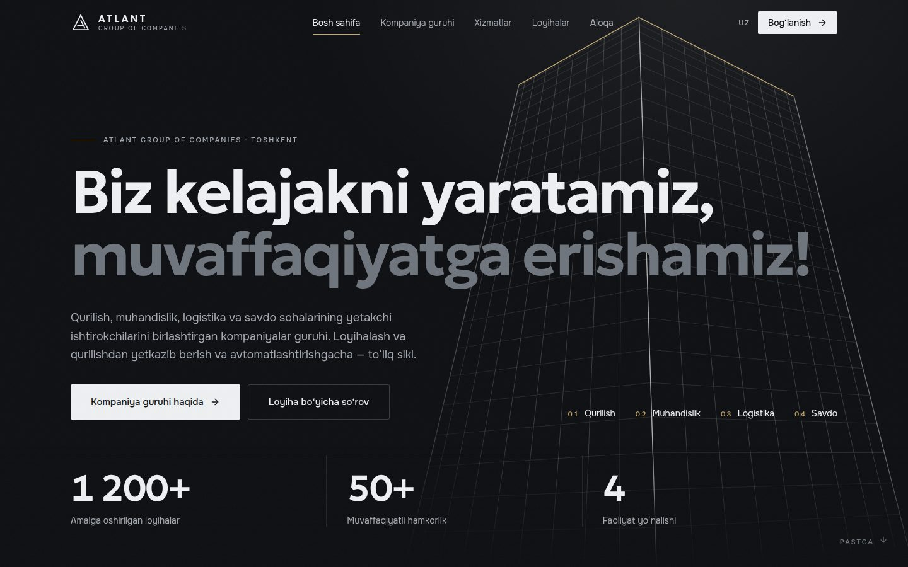
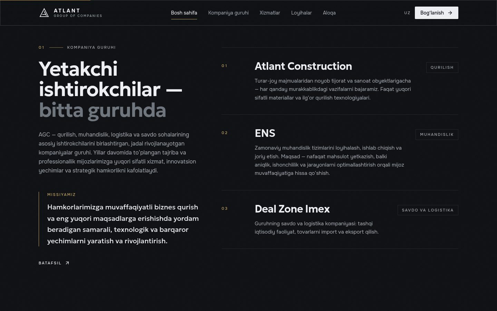
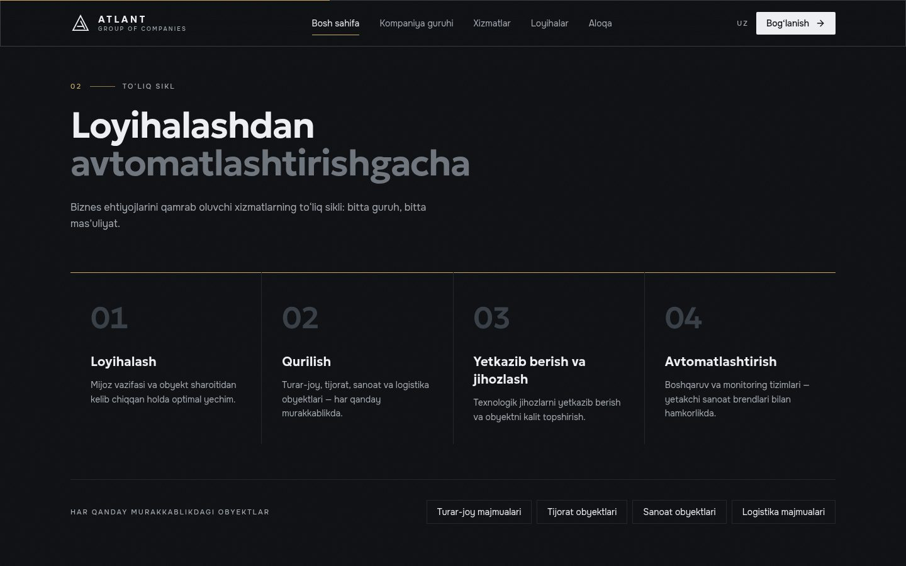
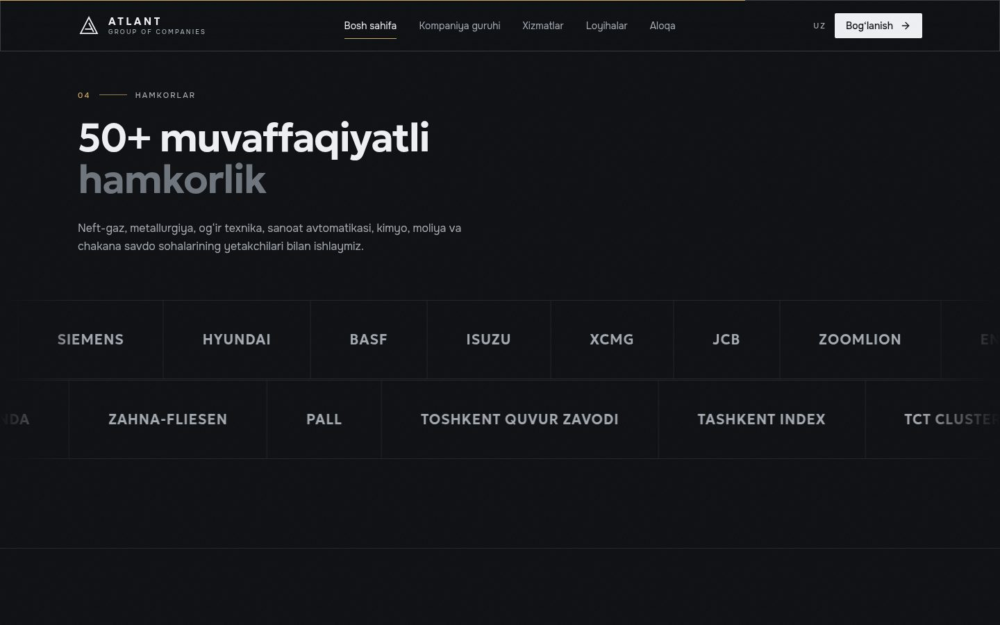
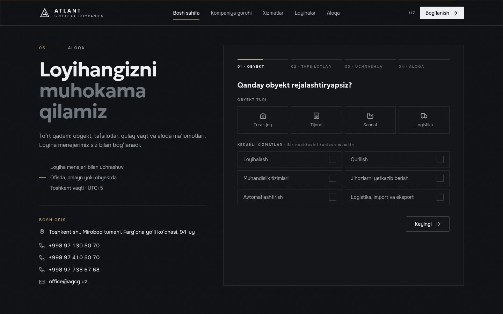
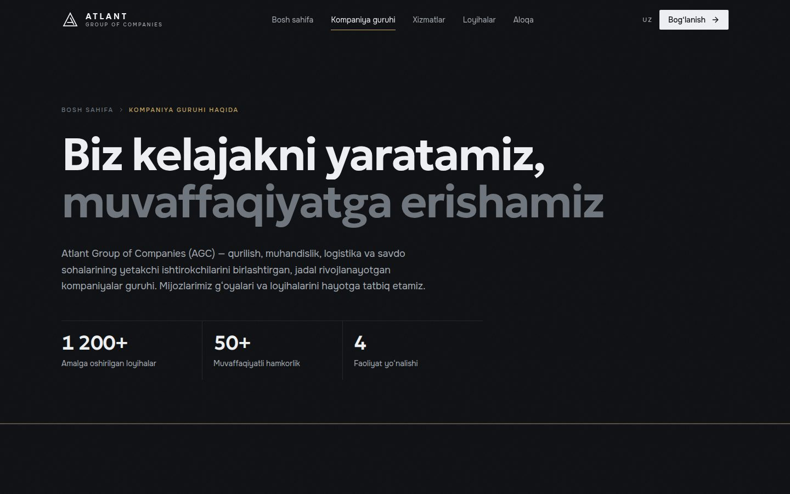
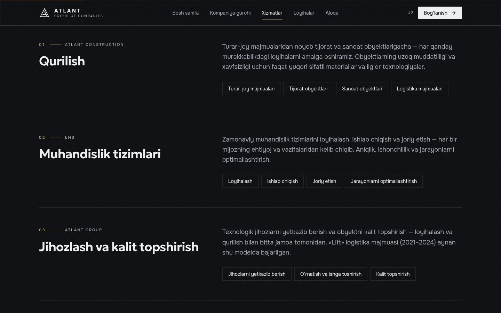

# Atlant Group of Companies — corporate website

Website for **Atlant Group of Companies** (AGC, [agcg.uz](https://agcg.uz)): a group that brings together construction, engineering, logistics and trade companies.
Uzbek-first (`/uz`), statically generated, four routes.

**Design direction.** Sober, architectural and corporate, to suit a group that delivers large projects:
- neutral graphite surfaces, white type and a single restrained brass accent;
- hairline rules and square corners;
- no cartoon-style 3D, no neon, no invented content.

The only illustration is an architectural line drawing in the hero (a worm's-eye view of a tower corner), which echoes the photo on the current agcg.uz.

| Home | | |
| --- | --- | --- |
|  |  |  |
|  |  |  |
| **/services** | **/projects** | |
|  |  | |


## Quick start

```bash
# Node ≥ 20.9
npm install
npm run dev              # http://localhost:3000 → /uz
npm run build && npm start
npm run typecheck
cp .env.example .env.local   # optional: TELEGRAM_BOT_TOKEN / TELEGRAM_CHAT_ID for inquiries
```

## Routes

| Route | What it is |
| --- | --- |
| `/uz` | The page runs top to bottom: slogan and published figures → the group's member companies and mission → the full cycle (design → construction → supply & fit-out → automation) → projects → partners → project inquiry |
| `/uz/about` | Group profile, figures, mission, member companies, principles and partners |
| `/uz/services` | Service lines (construction, engineering systems, fit-out & turnkey handover, automation, logistics & trade), each with the company that delivers it |
| `/uz/projects` | Published projects, the range of facilities, partners |

`/`, `/projects`, `/services` and `/about` redirect to the `/uz/…` equivalents.

## Content

**Source.** All company content lives in `src/i18n/dictionaries/uz.ts` and `src/lib/site.ts`. Every fact comes from agcg.uz: the home page, `/about`, `/partnership` and `ens.agcg.uz/mission`. The build environment's network policy blocks agcg.uz, so these were read through the site's search-indexed text. Nothing is invented: there are no sample projects, histories, prices or cities.

**What's on the site:**
- **Group:** Atlant Group of Companies (AGC), with the slogan "Biz kelajakni yaratamiz, muvaffaqiyatga erishamiz!", the group description and the mission.
- **Member companies:** Atlant Construction (construction), ENS (engineering systems) and Deal Zone Imex (trade & logistics).
- **Figures:** 1200+ realised projects, 50+ successful partnerships, and 4 sectors.
- **Projects:**
  - «Lift» logistics complex: design, construction and turnkey equipment, 2021–2024.
  - Balton warehouse: a completed project of ENS.
- **Partners:** names from the agcg.uz partners and about pages, including LUKOIL Uzbekistan, Siemens, Hyundai, BASF, XCMG, JCB, Endress+Hauser and Toshkent quvur zavodi.
- **Contacts:** three phone numbers, office@agcg.uz, and the office at Farg‘ona yo‘li 94, Mirobod tumani, Toshkent.

**To confirm with Atlant before launch:**
- The pairing of the two figures. The indexed text reads "successful partnerships · 50+ · realized projects · 1200+".
- The full project list, with photos. Project cards show a photo as soon as `image` is set in the dictionary; there are no placeholder frames.
- Whether any other companies on agcg.uz/about (e.g. RSCS, RCMCS) are group members rather than partners.
- The official logo. `components/ui/logo.tsx` and `app/icon.svg` hold a neutral placeholder.
- The office map coordinates and the Telegram/Instagram handles (`src/lib/site.ts`).
- Russian and English versions. The real site offers UZ/RU/EN; add `ru.ts` and `en.ts` (see Notes).

## Stack

- Next.js 15.5: App Router, React Server Components, Server Actions, SSG.
- React 19, Tailwind CSS v4 (CSS-first `@theme`), Framer Motion, Lenis, lucide-react, zod 4.
- Fonts, self-hosted via `next/font` with Cyrillic: **Geologica** for display and **Onest** for text.

No WebGL. Home first-load JS is about 184 kB.

```
src/
├─ app/
│  ├─ [locale]/              # root layout (fonts, metadata, JSON-LD), template (route curtain), 4 pages, 404
│  ├─ actions/inquiry.ts     # "use server": zod validation, Tashkent-time slots, honeypot, Telegram delivery
│  └─ globals.css            # design system (Tailwind v4 @theme tokens + utilities)
├─ components/
│  ├─ sections/              # Hero, TowerDrawing, GroupSection, FullCycle, ProjectsSection, PartnersSection,
│  │                         # Principles, ServicesList, CtaBand, contact/{ContactSection, InquiryForm}
│  ├─ layout/                # Header, Footer, NavLink (Lenis-aware), SmoothScroll (+ route scroll manager)
│  └─ ui/                    # button, count-up, logo, page-header, section-heading
├─ lib/                      # site.ts (contacts), booking.ts (slots, ICS), motion, utils
├─ i18n/                     # config, get-dictionary, dictionaries/uz.ts (all copy)
└─ hooks/useReducedMotion.ts
```

## Inquiry form

The form has four steps: facility type and services → region, area and budget → meeting format, date and slot → contact details (with an optional company field).
- The server action re-validates every field, including the Tashkent-time slot (no Sundays, at least 2 h lead).
- Inquiries go to Telegram when `TELEGRAM_BOT_TOKEN` and `TELEGRAM_CHAT_ID` are set; otherwise they are logged.
- On success the visitor can download an `.ics` invite.

## Notes

- Next.js is pinned to **15.x**. `overrides.next.postcss` lifts Next's bundled PostCSS to a patched release.
- `prefers-reduced-motion` is honoured: Lenis, CSS animations, the hero drawing and count-ups all respect it, and the partner marquee becomes a static grid.
- Adding a locale: create `i18n/dictionaries/ru.ts` typed as `Dictionary`, then register it in `get-dictionary.ts` and `i18n/config.ts`.
- Earlier iterations are in this branch's history: the 3D "cyber" showcase in `e9025cb` and the rendered construction film in `46f953c`. They were replaced at the client's request ("no cartoon-like site").
